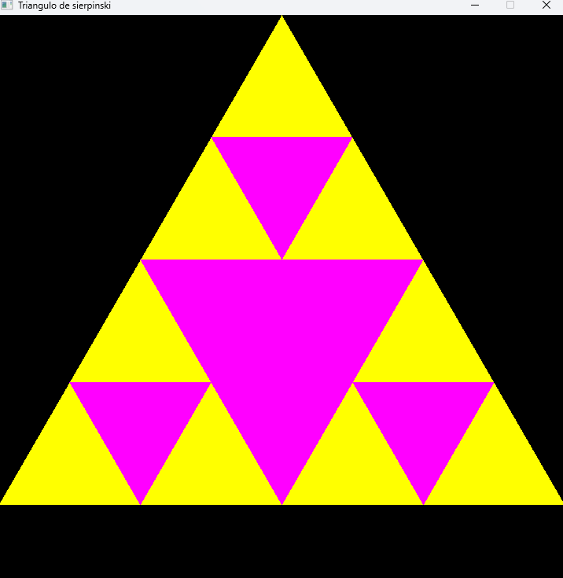
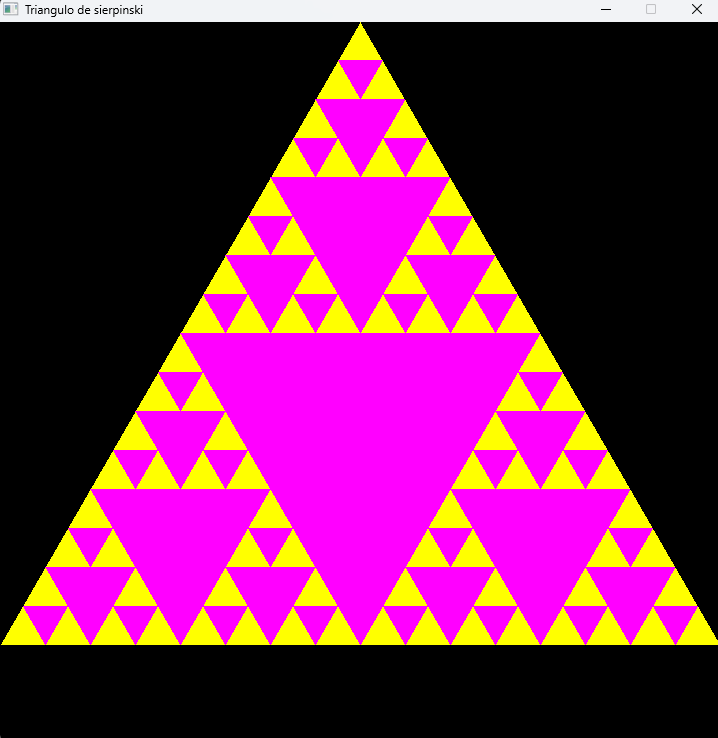
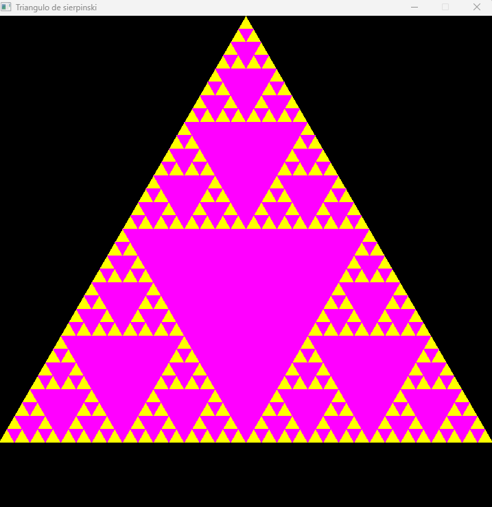

# Triângulo de Sierpinski

Este projeto implementa o **Triângulo de Sierpinski**, uma estrutura fractal, utilizando a linguagem **C** e a biblioteca **SDL2**.  
Ele foi desenvolvido para a disciplina de **Vida Artificial na Computação**, como parte dos estudos sobre fractais, auto-similaridade e sistemas complexos.

Apesar do readme.md ser recente, o projeto foi criado em 2020 e o código reflete as minhas skills da epoca.

---

## 🚀 Tecnologias Utilizadas

- **C (GCC ou compatível)**
- **SDL2**

---

## 🖥️ Como Compilar e Executar

### 🔧 Instalação das Dependências

- **Ubuntu/Debian**

  ```bash
  sudo apt update
  sudo apt install build-essential libsdl2-dev
  ```

- **Fedora**

  ```bash
  sudo dnf install gcc SDL2-devel
  ```

- **Arch Linux**

  ```bash
  sudo pacman -S sdl2
  ```

- **Windows**
  1. Instale o [MSYS2](https://www.msys2.org/) e abra o terminal MSYS2 MinGW64.

  2. Atualize os pacotes

     ```bash
      pacman -Syu
      ```

      Feche e reabra o terminal e rode:

       ```bash
      pacman -Su
      ```

  3. Instale o compilador, make e a SDL2:

      ```bash
      pacman -S mingw-w64-x86_64-gcc mingw-w64-x86_64-SDL2 make
      ```

  4. Copie o arquivo SDL2.dll para a pasta do projeto que contem o executavel (/files). Usualmente, o arquivo fica em _C:\msys64\mingw64\bin\SDL2.dll_

---

### ▶️ Compilando o Projeto

1. Clone o repositório:

   ```bash
   git clone https://github.com/AnabelCristina/TrianguloDeSierpinski.git
   cd TrianguloDeSierpinski/files
   ```

2. Compile o código usando make:

   ```bash
   make
   ```

3. Para apagar o executavel e recompilar do zero:

   ```bash
   make clean
   ```

4. Execute o programa:

- Windows

    ```bash
    ./sierpinski.exe
    ```

- Linux

    ```bash
    ./sierpinski
   ```

---

## 📸 Exemplo de Saída

Alterando a linha **109** ("level = 3"), é possivel gerar diferentes fractais.

Level = 3


Level = 5


Level = 6


---

## 🎓 Créditos

Projeto desenvolvido por **Anabel Cristina** durante a disciplina _Vida Artificial na Computação_.  
Faculdade: UFABC - Universidade Federal do ABC.
